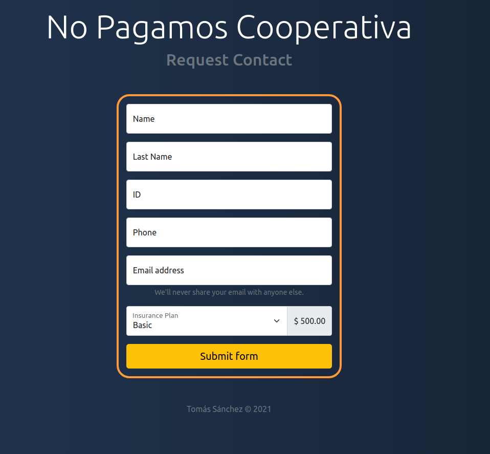

# Insurance Form

## Requirements

  
Seguro No Pagamos Cooperativa is an insurance company that has been in the market for 2 years. So far they work with traditional sales schemes, that is to say, contact by telephone or through their advisors with potential clients.
  
The company's board of directors met with the IT department to request a website development. The objective is that future clients can request a contact through the web so that an advisor can contact them.
  
You as part of the development team must make the HTML layout of this website, giving it styles with the use of CSS
  
The data that must be requested are the following:

- Name
- Last name
- DNI
- E-mail
- Telephone
- Type of insurance
    - Basic
    - Intermediate
    - Premium

When selecting the type of insurance (basic, intermediate, premium) the screen should show the value of each one:

- Basic: $ 500
- Standard: $ 1000
- Premium: $ 1500
  

## Solution

  
