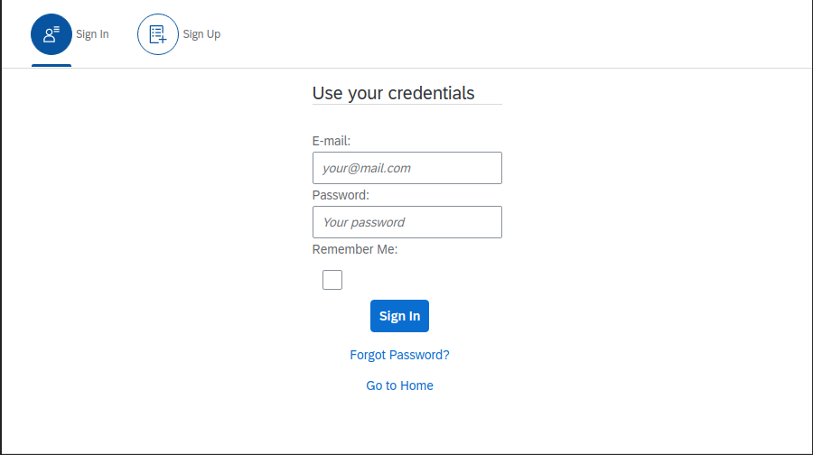
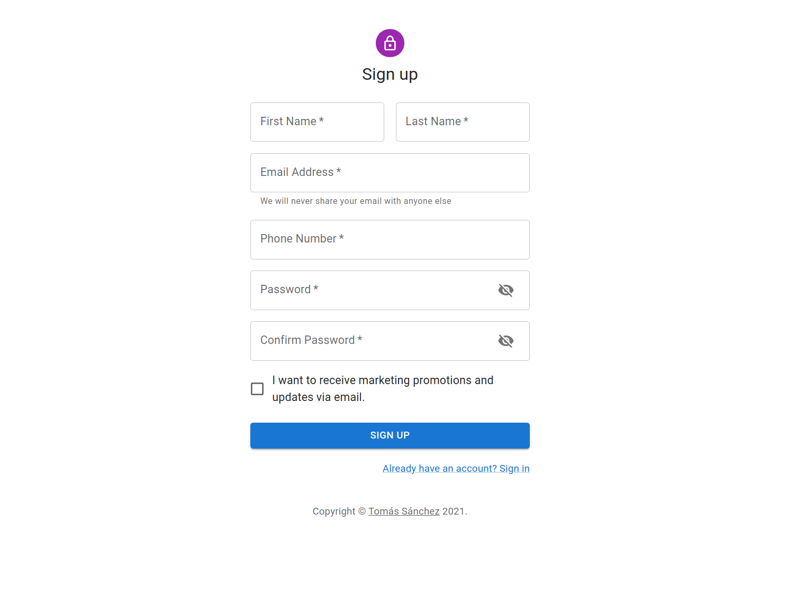
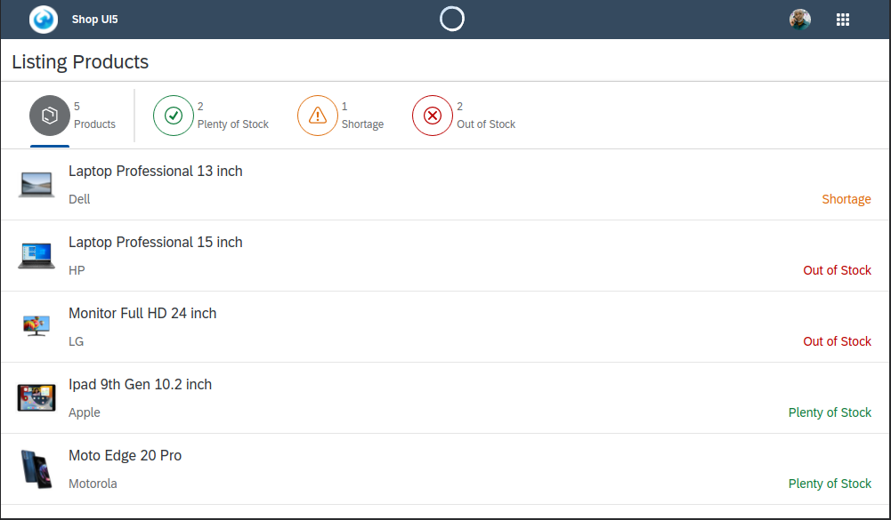
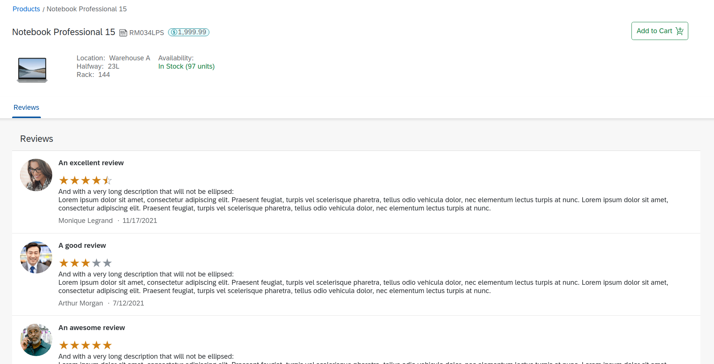
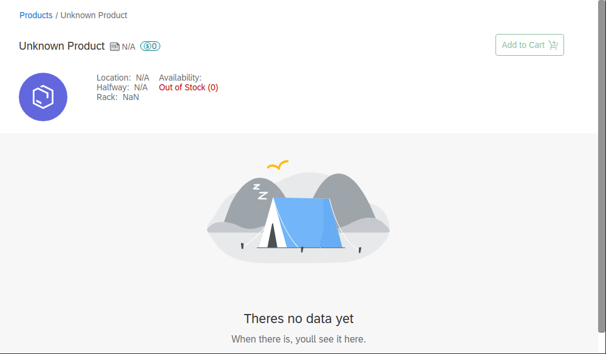

# Products

## Requirements

  
Create an application with react cli called "myapp".
  
Develop the layout of a product detail page for an ecommerce site, the following data should be displayed:

- Register
    - Only make layout, the user should not be saved in any database
- Login
    - Only make layout, the user should not be saved in any database
- Home / Worklist
    - At least a list of 4 products obtained from an external source should be displayed (rest api or json file)
- Product / Detail Page
    - Detail of a product, obtaining the data from a rest api or json file. 
    - Some fields to view are:
        - Name
        - Price
        - "Buy" button
  

## Solution

  

### Login

### Register

### Worklist Page

### Detail -  Found

### Detail - Not Found
